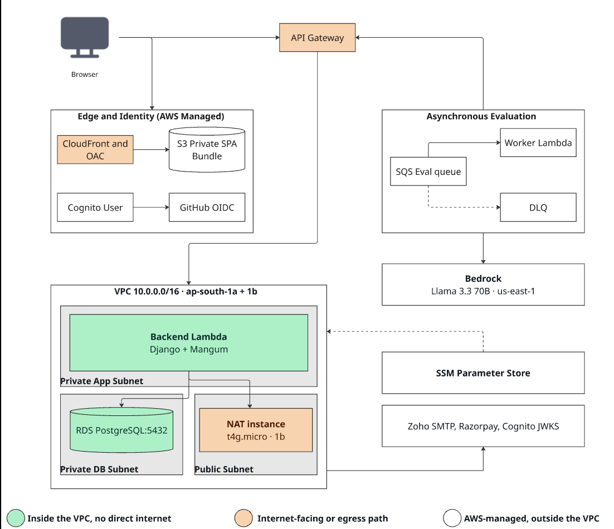

<p align="center">
  
</p>

<h1 align="center">Structra</h1>

<p align="center">
  Collaborative software architecture design, AI-assisted evaluation, and team workspace management — all in one platform.
</p>

<p align="center">
  <a href="https://structra.cloud"><strong>structra.cloud</strong></a> &nbsp;·&nbsp;
  <a href="https://structra.cloud/documentation/">Docs</a> &nbsp;·&nbsp;
  <a href="https://structra.cloud/pricing">Pricing</a>
</p>

<p align="center">
  
  
  
</p>

---

## Architecture



> Full architecture documentation: [project-documentation/architecture.md](project-documentation/architecture.md)

---

## Repository Structure

This is a monorepo. All three services live here and are deployed independently.

```
structra/
├── backend/          # Django REST API — business logic, auth, data, billing
├── worker/           # Evaluation worker — job processing, rule engine, AI
├── frontend/         # React app — all end-user product surfaces
├── docs/             # Docusaurus site — product documentation
├── docker-compose.yml
└── .github/
    └── workflows/    # CI/CD: deploy backend+worker, deploy frontend, infra ops
```

---

## Services

### `backend/` — Django REST API

The API server that the frontend talks to. Owns all persistent data, authorization, and business policy.

**Responsibilities**
- Authentication: password, OTP, Google OAuth, GitHub OAuth, JWT issuance
- Workspace and system (canvas) lifecycle
- Collaboration: membership, per-system permissions, invitations
- Comments, notifications, audit logging
- Evaluation dispatch: accepts requests, enqueues jobs for the worker
- Usage accounting: AI credits, insight tokens, seat limits
- Billing: Razorpay subscriptions, webhooks, plan state

**Stack:** Django 6 · Django REST Framework · PostgreSQL · SimpleJWT · Razorpay · gunicorn

**Structure**
```
backend/
├── config/               # Django project config and settings (local / production)
├── accounts/             # Auth, OTP, OAuth, JWT, profile, user search
│   └── services/         # Business logic: plan enforcement, downgrade, username utils
├── workspaces/           # Workspace CRUD, starring, discovery, credits, evaluation runs
├── systems/              # System CRUD, autosave, comments, evaluation API + queue publish
├── permissions/          # Workspace membership, per-system access control
├── notifications/        # Invitations, notification feed
├── audit/                # Audit models, event recording, summary endpoints
├── payments/             # Razorpay checkout, orders, webhooks, subscription sync
│   └── services/         # Billing business logic: seat management
├── core/                 # Shared constants, pricing helpers, health endpoint
├── Dockerfile
├── manage.py
└── requirements.txt
```

**Key API endpoints**

| Area | Examples |
|---|---|
| Health | `GET /api/health/` |
| Auth | `POST /api/auth/login/` · `/register/` · `/google/` · `/github/` · `/email-otp/*` · `/password-reset/*` |
| Users | `GET /api/users/search/` · `/api/users/<username>/profile/` |
| Workspaces | `GET/POST /api/workspaces/` · `GET /api/workspaces/public/search/` |
| Systems | `GET/POST /api/workspaces/<id>/canvases/` · `PUT /api/systems/<id>/canvas/` |
| Permissions | `GET /api/workspaces/<id>/members/` · `POST /api/workspaces/<id>/systems/<id>/permissions/` |
| Invitations | `POST /api/workspaces/<id>/invitations/` · `POST /api/invitations/accept/` |
| Notifications | `GET /api/notifications/feed/` |
| Audit | `GET /api/workspaces/<id>/audit/logs/` |
| Evaluation | `POST /api/evaluate/` · `GET /api/evaluate/<run_id>/` · `GET /api/evaluation/insight-tokens/` |
| Payments | `POST /api/payments/checkout/` · `POST /api/payments/webhook/` |

---

### `worker/` — Evaluation Worker

A long-running background process that consumes evaluation jobs from a queue, runs the rule engine, calls the Gemini AI API for suggestions, and writes results back to the database. Completely separate from the HTTP server — no ports, no web middleware.

**Responsibilities**
- Dequeue evaluation jobs (local DB queue in dev, AWS SQS in production)
- Run the Node.js rule engine against a system's canvas state
- Call the Gemini API for AI-generated architectural suggestions
- Write scores, results, and suggestions back to `EvaluationRun`
- Refund insight tokens on Gemini failures
- Record audit events for evaluation lifecycle

**Stack:** Python 3.12 · Django ORM (models only, no HTTP) · Node.js (rule engine subprocess) · boto3 (SQS) · Gemini API

**Structure**
```
worker/
├── evaluation_worker.py     # Entry point — main loop, dequeue → process → ack/fail
├── evaluation_service.py    # Job execution: rule engine, Gemini call, DB writes
├── evaluation_queue.py      # Queue abstraction: LocalQueue (DB) and SQSQueue (AWS)
├── sqs_publisher.py         # SQS send helper
├── sqs_worker.py            # Thin SQS-mode entry wrapper
├── evaluation/
│   ├── runner.mjs           # Node.js rule engine entry point
│   └── evaluateRules.mjs    # Rule evaluation logic
├── worker_hub/
│   └── settings/            # Minimal Django settings (no admin, no DRF, no middleware)
├── tests/                   # Worker-internal tests (queue mechanics, token refunds)
└── Dockerfile               # Builds from monorepo root; copies backend/ for PYTHONPATH
```

**How the worker accesses shared models:** The worker's Dockerfile copies `backend/` into the image and sets `PYTHONPATH=/app/backend`. This gives the worker full ORM access to models in `workspaces`, `canvases`, `accounts`, and `audit` without duplicating them. Migrations are always run by the backend — the worker never migrates.

**Queue modes**

| `USE_SQS` | Transport | Used in |
|---|---|---|
| `false` (default) | `EvaluationQueueJob` table (PostgreSQL) | Local dev |
| `true` | AWS SQS | Production |

---

### `frontend/` — React Application

The browser app for all end-user product surfaces: marketing pages, authentication, workspace management, system canvas editing, evaluation, notifications, billing, and docs links.

**Stack:** React 19 · Vite · React Router · Tailwind CSS · Axios · Razorpay

**Structure**
```
frontend/
├── src/
│   ├── pages/
│   │   ├── public/       # Landing, pricing, terms, privacy
│   │   ├── auth/         # Login, signup, OTP, password reset, OAuth callbacks
│   │   ├── onboarding/   # First-time user flow
│   │   ├── account/      # Profile, public user pages
│   │   ├── workspace/    # Workspace home, discovery, settings (team/security/logs), evaluations
│   │   ├── system/       # Canvas editor, evaluation results, presentation mode
│   │   ├── invitations/  # Invite links, accept/reject flows, inbox
│   │   └── infrastructure/ # Health guard, server-down, 404
│   ├── components/       # Shared UI components (including Razorpay payment flow)
│   ├── contexts/         # Auth context, theme context
│   ├── hooks/            # Data-fetching hooks
│   ├── evaluation/       # Evaluation result rendering
│   └── utils/            # API client (Axios + token refresh), helpers
├── index.html
├── vite.config.js
└── package.json
```

**Route surface**

| Type | Routes |
|---|---|
| Public | `/` · `/login` · `/signup` · `/pricing` · `/invite/:token` · `/auth/github/callback` · … |
| Protected | `/app/home` · `/app/ws/:id` · `/app/ws/:id/systems/:id` · `/app/ws/:id/settings/*` · … |

The frontend performs a backend health check on load and blocks rendering until the API responds. All authorization truth lives in backend responses — the frontend only renders state.

---

### `docs/` — Documentation Site

Static documentation served from [structra.cloud/documentation](https://structra.cloud/documentation/). Covers platform concepts, getting started, account management, and Structra's evaluation rule library.

**Stack:** Docusaurus 3 · React · Markdown/MDX

**Structure**
```
docs/
├── docs/                          # Markdown content
│   ├── index.md
│   ├── getting-started.md
│   ├── account-and-identity.md
│   └── evaluation-principles/
│       ├── structra-basics/       # Rule library (free / pro / enterprise tiers)
│       └── production-system-principles.md
├── src/
│   ├── css/custom.css
│   └── components/                # RuleTable, HomepageFeatures
├── static/js/sidebar-search.js
├── docusaurus.config.js
└── sidebars.js
```

---

## Local Development

The fastest way to run everything locally is Docker Compose from the repo root.

### Prerequisites

- Docker and Docker Compose
- `backend/.env.local` populated (see below)

### Start all services

```bash
docker compose up --build
```

| Service | URL |
|---|---|
| Backend API | http://localhost:8000 |
| Frontend | http://localhost:5173 |
| Docs | http://localhost:3000 |
| Postgres | localhost:5432 |

On first run the `migrate` service runs `manage.py migrate` before the backend and worker start.

### What runs

- **`db`** — PostgreSQL 16
- **`migrate`** — Runs Django migrations once, then exits
- **`backend`** — Django `runserver` with live-reload via volume mount
- **`worker`** — Evaluation worker with live-reload (mounts both `./worker` and `./backend`)
- **`frontend`** — Vite dev server with HMR
- **`docs`** — Docusaurus dev server

### Without Docker (backend only)

```bash
cd backend
python -m venv .venv && source .venv/bin/activate
pip install -r requirements.txt
python manage.py migrate
python manage.py runserver
```

### Without Docker (worker only)

```bash
cd worker
PYTHONPATH=../backend DJANGO_ENV=local python evaluation_worker.py
```

---

## Environment Variables

### `backend/.env.local`

```bash
DJANGO_ENV=local
DJANGO_SECRET_KEY=change-me

# Database
DB_ENGINE=django.db.backends.postgresql
DB_NAME=structra
DB_USER=postgres
DB_PASSWORD=structra_root
DB_HOST=localhost
DB_PORT=5432

# OAuth
GOOGLE_CLIENT_ID=
GITHUB_CLIENT_ID=
GITHUB_CLIENT_SECRET=

# Email (SMTP)
EMAIL_HOST=
EMAIL_PORT=587
EMAIL_USE_TLS=True
EMAIL_HOST_USER=
EMAIL_HOST_PASSWORD=
DEFAULT_FROM_EMAIL=

# Frontend URLs
FRONTEND_INVITE_BASE_URL=http://localhost:5173/invite
CORS_ALLOWED_ORIGINS=http://localhost:5173
CSRF_TRUSTED_ORIGINS=http://localhost:5173
DJANGO_ALLOWED_HOSTS=localhost,127.0.0.1

# Razorpay (billing)
RAZORPAY_KEY_ID=
RAZORPAY_KEY_SECRET=
RAZORPAY_WEBHOOK_SECRET=
RAZORPAY_PLAN_ID_INDIVIDUAL=
RAZORPAY_PLAN_ID_TEAM=

# Gemini (evaluation AI)
GEMINI_API_KEY=
GEMINI_MODEL=gemini-2.5-flash

# Queue (USE_SQS=false uses local DB queue)
USE_SQS=false
EVALUATION_LOCAL_QUEUE_POLL_INTERVAL_SECONDS=5
EVALUATION_LOCAL_QUEUE_RETRY_DELAY_SECONDS=10
EVALUATION_LOCAL_QUEUE_MAX_ATTEMPTS=3
EVALUATION_LOCAL_QUEUE_LOCK_TIMEOUT_SECONDS=300
```

### `frontend/.env.local`

```bash
VITE_API_BASE_URL=http://127.0.0.1:8000/api/
VITE_FRONTEND_URL=http://localhost:5173
VITE_GOOGLE_CLIENT_ID=
VITE_GITHUB_CLIENT_ID=
VITE_RAZORPAY_KEY_ID=
```

---

## CI/CD

All workflows live in `.github/workflows/` and are picked up by GitHub from the monorepo root.

| Workflow | Trigger | What it does |
|---|---|---|
| `deploy-backend.yml` | Push to `main` on `backend/**` or `worker/**` | Builds and pushes API + worker Docker images to ECR, deploys via SSM |
| `deploy-frontend.yml` | Push to `main` on `frontend/**` | Builds React app, syncs to S3, invalidates CloudFront |
| `manual-infra-start.yml` | Manual | Starts EC2 + RDS |
| `manual-infra-stop.yml` | Manual | Stops EC2 + RDS |
| `manual-ec2-start/stop.yml` | Manual | EC2 only |
| `manual-rds-start/stop.yml` | Manual | RDS only |
| `scheduled-rds-stop.yml` | Cron (every 6h) | Stops RDS if running |
| `infra-start/stop.yml` | Manual (stop disabled) | Combined infra ops |

---

## Production Infrastructure

- **Backend + Worker:** EC2 (Docker containers), ECR for images, RDS PostgreSQL
- **Frontend:** S3 + CloudFront
- **Docs:** Deployed separately via Docusaurus deploy
- **Queue:** AWS SQS (`USE_SQS=true` in production env)
- **Region:** `ap-south-2`
