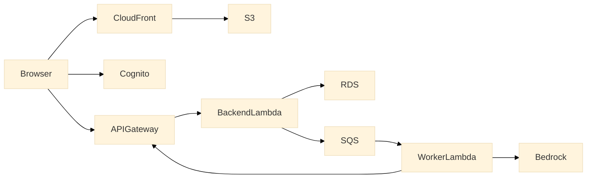

# Structra — Project Documentation

Internal technical documentation for the Structra monorepo.

---

## Contents

| Document | What it covers |
|---|---|
| [overview.md](./overview.md) | What Structra is, product concepts, tech stack, subscription plans |
| [architecture.md](./architecture.md) | Full system architecture — components, request flows, security |
| [aws.md](./aws.md) | AWS infrastructure, Terraform stacks, IAM, secrets, cost model |
| [auth.md](./auth.md) | Cognito setup, OTP flow, Google/GitHub OAuth, JWT validation |
| [backend.md](./backend.md) | Django apps, API endpoints, key models, evaluation dispatch |
| [worker.md](./worker.md) | Evaluation worker, rule engine, Bedrock AI, SQS queue |
| [local-dev.md](./local-dev.md) | How to run the full stack locally with Docker Compose |
| [cicd.md](./cicd.md) | GitHub Actions workflows, deployment order, OIDC setup |

## Architecture Diagram

The Mermaid source for the system architecture diagram is at [assets/architecture.mmd](./assets/architecture.mmd).

Render it with any Mermaid-compatible tool (GitHub renders `.mmd` files natively in markdown when embedded, or use [mermaid.live](https://mermaid.live) to export a PNG for linking in the main README).

